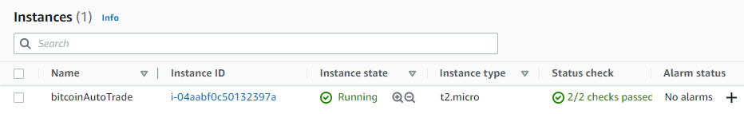
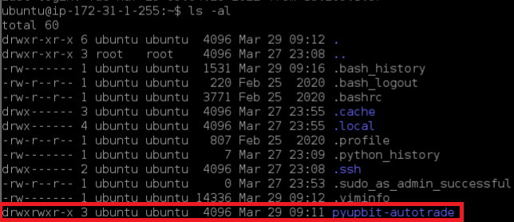
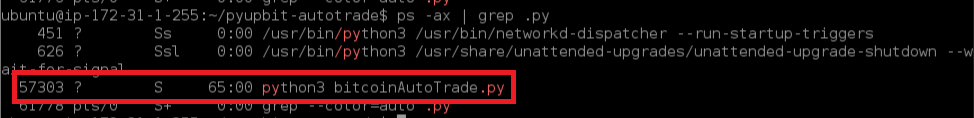

# 🍎 비트코인 자동매매

## 참고 자료
- 파이썬을 이용한 비트코인 자동매매 - 조대표

## 매매 전략 (변동성 돌파 전략)
1. 가격 변동폭 계산: 투자하려는 가상화폐의 전일 고가(high)에서 전일 저가(low)를 빼서 가상화폐의 가격 변동폭을 구한다.
2. 매수 기준: 당일 시간에서 (변동폭 * k) 이상 상승하면 해당 가격에 바로 매수한다.
3. 매도 기준: 당일 종가에 매도한다.

## 코드 리뷰
1. 주기적으로 현재가 받기
```python
def get_current_price(ticker):
    """현재가 조회"""
    return pyupbit.get_orderbook(ticker=ticker)["orderbook_units"][0]["ask_price"]

while True:
    current_price = get_current_price("KRW-BTC")
    time.sleep(1)
```
<br/>

2. 목표가 계산하기
```python
def get_target_price(ticker, k):
    """변동성 돌파 전략으로 매수 목표가 조회"""
    df = pyupbit.get_ohlcv(ticker, interval="day", count=2)
    target_price = df.iloc[0]['close'] + (df.iloc[0]['high'] - df.iloc[0]['low']) * k
    return target_price

while True:
    target_price = get_target_price("KRW-BTC", 0.5)
    time.sleep(1)
```
<br/>

3. 매수, 매도하기
```python
 if start_time < now < end_time - datetime.timedelta(seconds=10):
            target_price = get_target_price("KRW-BTC", 0.5)
            current_price = get_current_price("KRW-BTC")
            if target_price < current_price:
                krw = get_balance("KRW")
                if krw > 5000:
                    upbit.buy_market_order("KRW-BTC", krw*0.9995)
        else:
            btc = get_balance("BTC")
            if btc > 0.00008:
                upbit.sell_market_order("KRW-BTC", btc*0.9995)
        time.sleep(1)
```

## AWS 서버에 구축하기
1. EC2 구축


2. EC2 인스턴스에 코드 업로드
```bash
git clone https://github.com/JAEHYUN2022/bitcoinAutoTrade.git
```


3. 백그라운드 환경에서 코드 실행

```bash
sudo ln -sf /usr/share/zoneinfo/Asia/Seoul/ /etc/localtime

sudo apt update

sudo apt install python3-pip

pip3 install pyupbit

nohup python3 bitcoinAutoTrade.py > output.log &
```

